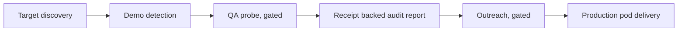

# DialProof

> White-label voice QA and production pod for AI voice agencies.

DialProof finds quality issues in an agency's AI voice deployments, which is the acquisition hook, then delivers the implementation and managed operations behind it. It is a safety first command line tool with a fully gated live layer.

> This repository is an architecture overview. The production code and data are private.

## How it works

## Stack

**Backend** &nbsp; Python CLI
**Data** &nbsp; SQLite
**Voice and AI** &nbsp; VAPI, gated
**Outreach** &nbsp; Email and IMAP, gated
**Reporting** &nbsp; Receipt backed audit renderer

## Engineering highlights

- Safety first by design: dry run by default, and every external action is gated behind an explicit flag plus dedicated credentials.
- Fully isolated venture, with its own database, its own config, and no shared keys or cross project access.
- A discovery and demo detection crawler that finds agencies running live voice agents.
- Receipt backed audit reports, where every finding is tied to its evidence.
- Suppression lists and per message approval gates on all outreach.

## Status

V1 scout and sales operations layer. Live actions are gated pending activation.

---

Part of the work of [Denis Redzic](https://denis.denisai.online).
